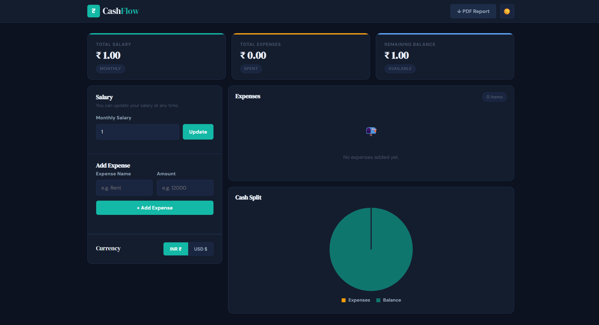

#  Cash-Flow – Salary & Expense Tracker (Sprint 02)

Cash-Flow is a **Vanilla JavaScript–based Salary & Expense Tracker** built as part of **Sprint 02 Engineering Deliverables**.  
The project focuses on **core JavaScript logic, DOM manipulation, state management, data persistence, and external integrations**, without using any frontend frameworks.

---

##  Sprint Objective

To build a **fully functional financial dashboard** where users can:
- Enter and update their salary
- Add, delete, and manage expenses
- View real-time balance calculations
- Persist data across browser reloads
- Visualize financial data
- Generate downloadable reports

##  Technical Architecture

The application follows a clean and scalable architecture:

1. **`appState`** – Single source of truth  
2. **Event Handlers** – Handle salary, expenses, delete, toggle actions  
3. **Render Layer** – Centralized `renderApp()` ensures consistent DOM state  
4. **Persistence Layer** – `localStorage` with JSON serialization  
5. **Utilities** – Formatting, calculations, conversions  

This structure makes the app **easy to debug, extend, and migrate to React later**.

---

## 🛠️ Tech Stack

- **HTML5**
- **CSS3**
- **Vanilla JavaScript (ES6)**
- **Chart.js** (via CDN)
- **jsPDF**
- **Frankfurter Exchange Rate API**
- **Browser LocalStorage**

---

## ✅ Sprint Status

- Phase 1 (Mandatory): **Completed**
- Phase 2 (Priority): **Completed**
- Phase 3 (Stretch Goals): **Completed**

All Sprint 02 deliverables successfully implemented using Vanilla JavaScript.

## important Links 
Github LInk--"https://github.com/ayushseth-coder" 
linkedin LInk--"https://linkedin.com/in/ayush-seth-b4265828a"
vercel LInk--"https://prodesk-project-02.vercel.app"
viedo LInk--"https://www.loom.com/share/9b3db74335df42e6862e6ae8ce8fd271"
Web Screenshot--""

## 👤 Author

**Ayush**  
Sprint 02 – Core Engineering Submission  
Prodesk IT